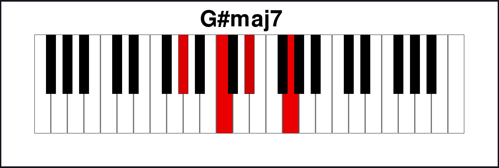
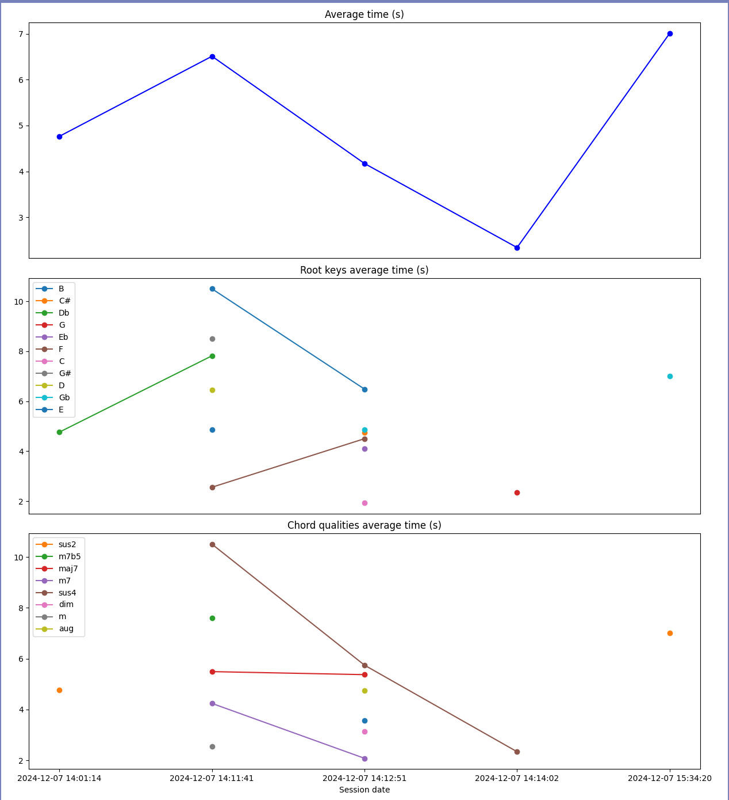

# Piano Training app

Simple Piano training app I made for myself, as I'm trying to learn piano.

### Features:

- MIDI connectivity (works with any MIDI compatible keyboard)
- Keyboard's key count and leftmost key are configurable
- Track your results' evolution over time
- For now only 1 "mode" is implemented:

  - A chord symbol is shown (Dbmaj7, Gsus4...) and you must play it as quick as possible
  - You can use any inversion of the chord
  - Results are shown per root note and per chord quality, over time (enharmonics are tracked and shown separately)
    
    

### Planned modes:

- Given a tonic and a progression (Dmin - II IV I), play it as quick as possible
- Recognize a chord drawn on the keyboard and type its name
- Play a scale / mode (both hands?)

Features requests & improvements are welcome

### License:

piano-trainer © 2024 by Zodiac is licensed under Creative Commons Attribution-NonCommercial-ShareAlike 4.0 International. To view a copy of this license, visit https://creativecommons.org/licenses/by-nc-sa/4.0/
